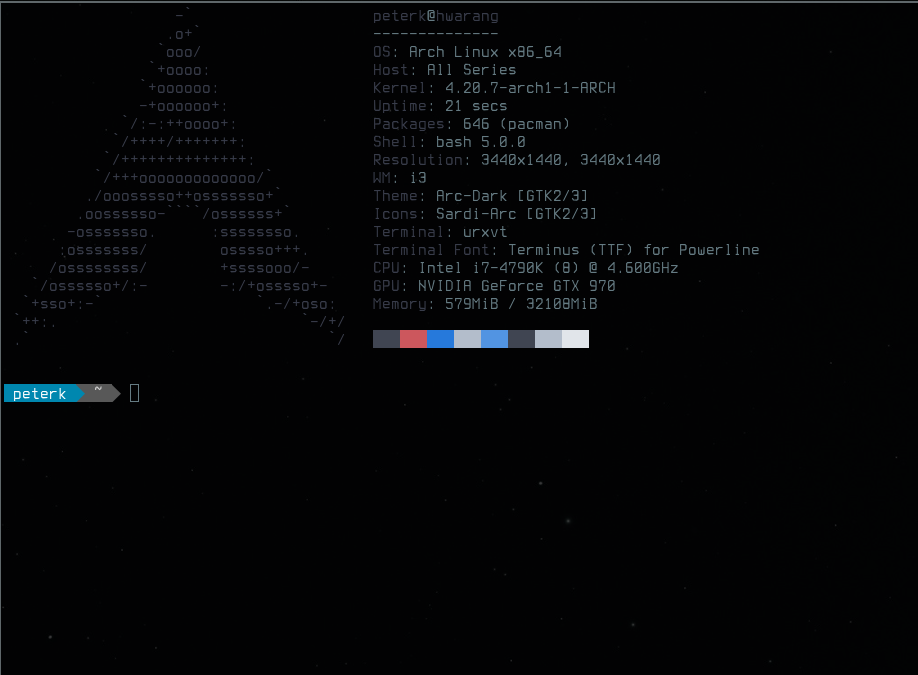

#Peter Kay
Site Reliability Engineer, Stack Overflow 

## Who are you, and what do you do?
I'm [Peter](https://kaypeter.com) and I work as a Site Reliability Engineer @ [Stack Overflow](https://stackoverflow.com) (SO). I make sure SO is running smoothly without issues and minimum amount of downtime. I also consult corporations on how to utilize the cloud to maximize their efficiency. I am a big advocate of the _"DevOps"_ methodology and automation. My day-to-day includes making the computers do my bidding so that I can relax at the beach drinking margaritas _**(shhh, don't tell the robots that!)**_.

## What hardware do you use?
We have desktop refreshes every few years at SO and my awesome colleague, [Nick Craver](https://nickcraver.com), wrote a wonderful [blog](https://nickcraver.com/desktop-build/) on the desktop build that all of our engineers use.

Since SO is a remote-first culture, I work from home frequesntly and built a desktop to my specifications.

Currently, my desktop build looks like this:

- CPU:
  - [Intel Core i7-4790K Processor](https://www.amazon.com/Intel-Core-i7-4790K-Processor-BX80646I74790K/dp/B00KPRWAX8/ref=sr_1_2?keywords=Intel+i7+4790k&qid=1550021725&s=gateway&sr=8-2)

- Memory:
  - [Corsair Vengeance Pro 32xGB (4x8GB) DDR3 1600 MHz](https://www.amazon.com/Corsair-CMY32GX3M4A1600C9R-Vengeance-4x8GB-Desktop/dp/B00D6E5K2A/ref=sr_1_8?keywords=vengeance+red+8gb&qid=1550021836&s=electronics&sr=1-8)

- Motherboard:
  - [Asus MAXIMUS VII HERO LGA 1150 Intel Z97](https://www.amazon.com/gp/product/B00K2MASE4/ref=oh_aui_search_asin_title?ie=UTF8&psc=1)

- Graphics:
  - [MSI GeForce GTX 970](https://www.amazon.com/gp/product/B00NN0GEXQ/ref=oh_aui_search_asin_title?ie=UTF8&psc=1)

- Storage:
  - [2 x 1TB WD Green Hard Drive](https://www.amazon.com/gp/product/B006GDVREI/ref=oh_aui_search_asin_title?ie=UTF8&psc=1)
  - [2 x Samsung 850 EVO 500GB SSD](https://www.amazon.com/gp/product/B00OBRE5UE/ref=oh_aui_search_asin_title?ie=UTF8&psc=1)
  - [4 x Samsung 850 EVO 250GB SSD](https://www.amazon.com/gp/product/B00OAJ412U/ref=oh_aui_search_asin_title?ie=UTF8&psc=1)

- Cooling:
  - [Corsair Hydro Series H100i GTX High Performance Liquid CPU Cooler](https://www.amazon.com/gp/product/B00SV7IEJI/ref=oh_aui_search_asin_title?ie=UTF8&psc=1)

- Monitor:
  - [2 x 34" Curved 21:9 UltraWide LG LED Monitor](https://www.lg.com/us/monitors/lg-34UC87C-B-ultrawide-led-monitor)

For peripherals, I have two ErgoDox EZ, one for the office and one for home. I use the Cherry MX Blue switches in the office because we are in our own [hex offices] _(or else my co-workers would hate me)_. I love the clicky noises that these switches produce as the sounds bounces off the glass walls. At home, I use the Cherry MX Brown switches for their subtle but tactile clicks _(or else my wife would hate me)_. I rarely use my mouse, but I use the [Razer Mamba Chroma](https://www.amazon.com/gp/product/B013HSWF40/ref=oh_aui_search_asin_title?ie=UTF8&psc=1) and the [Razer Firefly Mouse Mat](https://www.amazon.com/gp/product/B00Y4S5KPY/ref=oh_aui_search_asin_title?ie=UTF8&psc=1) because LED is life.

I also run a homelab at home with a [Dell R710]() that I salvaged off of eBay. It runs all of my virtual servers from backups to my Plex media server. As you can see, I'm very invested in my hardware. This baby has 128GBs of RAM and a 12-Core processor, more than enough to run whatever my heart desires _(well... almost)_. I also have a [Synology DS216play NAS](https://www.amazon.com/gp/product/B015JQAWW0/ref=oh_aui_search_asin_title?ie=UTF8&psc=1) on a RAID10 setup totalling 4TBs of usuable disk space. I also have a [4TB Seagate external harddrive](https://www.amazon.com/gp/product/B00ZTRXFBA/ref=oh_aui_search_asin_title?ie=UTF8&psc=1) to backup my NAS _(although this doesn't protect against fires or other disasters at home, I have been actively trying to avoid those...)_.

Now, enough about backups! The hardware that connects all of this together are my networking gear. I use a [Ubiquiti Edgerouter](https://www.amazon.com/gp/product/B00HXT8EKE/ref=oh_aui_search_asin_title?ie=UTF8&psc=1) to route traffic to and from the interwebz. I also have a [TP-Link 16-Port Gigabit Smart Switch](https://www.amazon.com/gp/product/B00K4DS67C/ref=oh_aui_search_asin_title?ie=UTF8&psc=1) segmented via VLAN for everything else that needs access to my LAN. This includes my PC, smart hubs, server, management cards, NAS, and any other devices that require a hard-link. I also have a [NETGEAR R7000 Nighthawk AC1900 Dual Band Wi-Fi Router](https://www.amazon.com/R7000-100PAS-Nighthawk-Parental-Controls-Compatible/dp/B00F0DD0I6/ref=sr_1_1?keywords=NETGEAR+r7000&qid=1550025681&s=gateway&sr=8-1) for all of my smart devices, Amazon Echos, and smart bulbs. 

Surely with all this hardware, I must have a decent chair to sit and enjoy all of my hard earned investments, right? Yep! I use the [Blue Wau Desk Chair](https://scandinaviandesigns.com/collections/wau-office-collection/products/wau-desk-chair-blue) by [Scandinavian Designs](https://scandinaviandesigns.com). And yes, this is the same chair that Richard fell from on HBO's Silicon Valley.

## And what software?

I mentioned before that I rarely use my mouse. This is because I use [Arch-Linux](https://archlinux.org) as my main driver for my operating system. My [dotfiles](https://github.com/deuscode/Dotfiles_i3) are a fork of [Algorithm79](https://github.com/Algorithm79/Dotfiles_i3) and includes a bunch of keyboard hotkeys for all of my day-to-day operations. I use this these settings both at work and home.

I use [Visual Studio Code](https://code.visualstudio.com/) for all of my code crunching at work. We are a .NET shop so most of the magic happens in C#. I use urxvt for terminal and [VMware Player](https://www.vmware.com/products/workstation-player.html) to run my Windows VM. I'm supposed to be the PowerShell expert, but ironically I'm running Windows over my Linux machine _(again, shhh... don't tell the humans!)_.

As for my home setup, I run [ProxMox](https://www.proxmox.com/en/) as my hypervisor on the Dell R710 and deploy linux containers from there. I can write pages worth of stuff, but I think this piece would be too long for the scope of this interview _(and again, shhh... don't tell the folks at ErgoDox)_.

## What’s your keyboard setup like? Do you use a custom layout or custom keycaps?
I use the all black Ergodox EZ with LEDs, blank keycaps and Cherry MX Brown switches at home and Blue at work. I might purchase some Kailh switches to try out how they feel and sound.

As for the layout, I use a simple [layout](https://configure.ergodox-ez.com/layouts/GjKV/latest/0) which offers me the ability to write scripts a lot easier. I also have been switching between qwerty and dvorak layouts to see which one suits me best. It's all about that efficiency life!

## What would be your dream setup?
Honestly, I would need to be a rich man to have a dream setup in mind. I would have all these LEDs, rack mounted servers, and plus more! I would like something simple and clean like the picture below, but I would have to move out of my small apartment and into a house of my own.

Of course I would replace those keyboards with the ErgoDox =)

